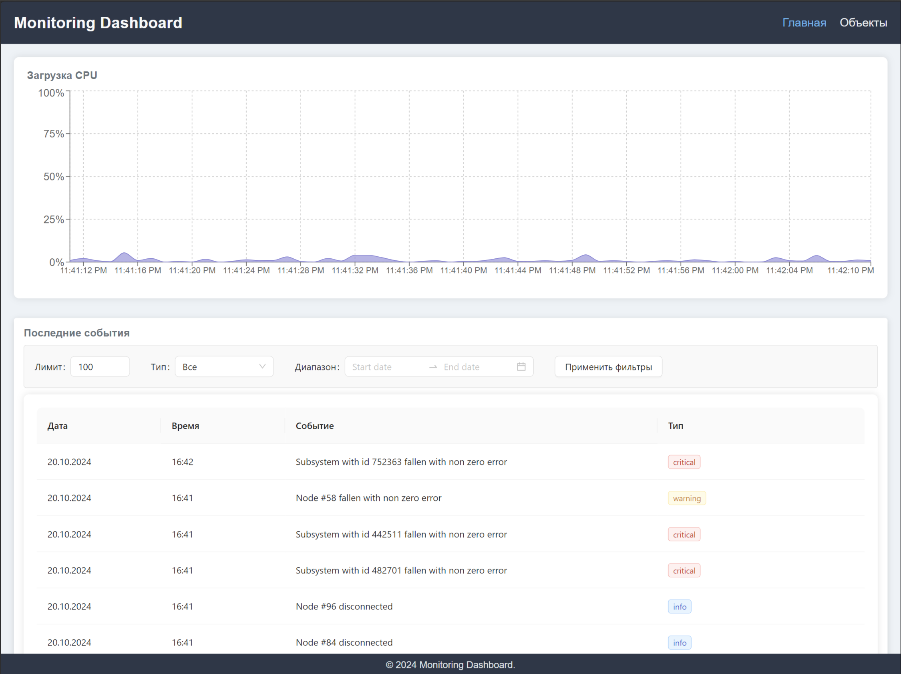
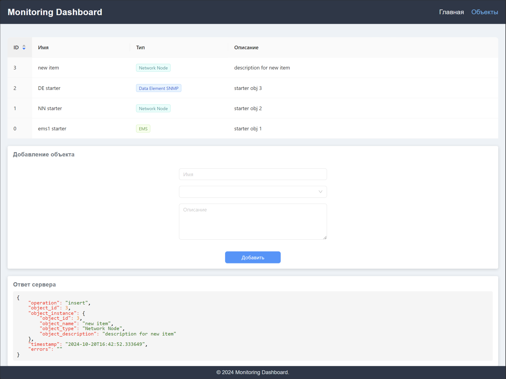

# Monitoring dashboard
тестовое задание

## Описание проекта
Задание состоит из двух подпроектов: 
- api, REST API сервис основанный на фреймворке FastAPI
- client, приложение на React, для получения и отображения данных с api-сервиса.  

## Запуск проекта

### Запуск проекта в Docker
Для запуска проекта в Docker окружении достаточно запустить в корне проекта команду

`docker-compose up -d`

После этого client будет доступен по адресу http://localhost:3000, а Swagger документация api сервиса будет доступна по адресу http://localhost:8000/docs 

### Запуск проекта вручную

Для того, чтобы запустить api сервис нужно:
- перейти в папку api
`cd api`
- создать виртуальное окружение
`python3 -m venv venv`,
- перейти в виртуальное окружение
`source venv/bin/activate`,
- установить зависимости
`python setup.py install`,
- и запустить api сервис командой 
`uvicorn server:app --reload`.

После этого Swagger документация api сервиса будет доступна по адресу http://localhost:8000/docs

Для того, чтобы запустить клиентское приложение нужно:
- перейти в папку client
`cd client`
- установить зависимости
`npm i`
- запустить проект (например в режиме отладки)
`npm run dev`

После этого client будет доступен по адресу http://localhost:3000

## Клиентское приложение 

Клиент состоит из двух страниц: "Главная" и "Объекты".

На главной странице отображается график загрузки процессора и таблица с событиями

На странице "Объекты" отображается таблица со списком объектов, форма для добавления нового объекта. JSON ответ от сервера отображается в отдельной карточке под формой добавления нового объекта

